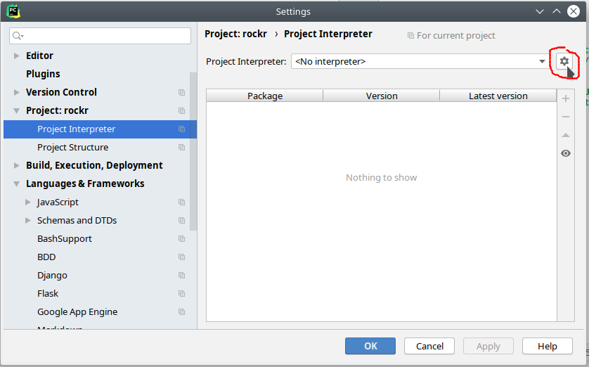
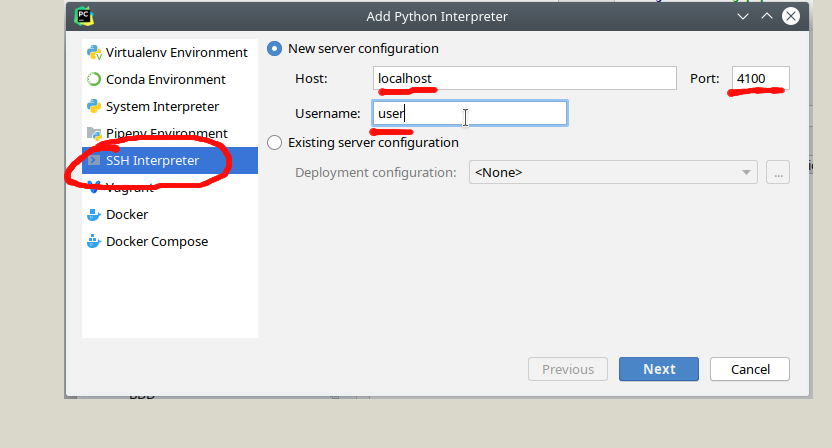
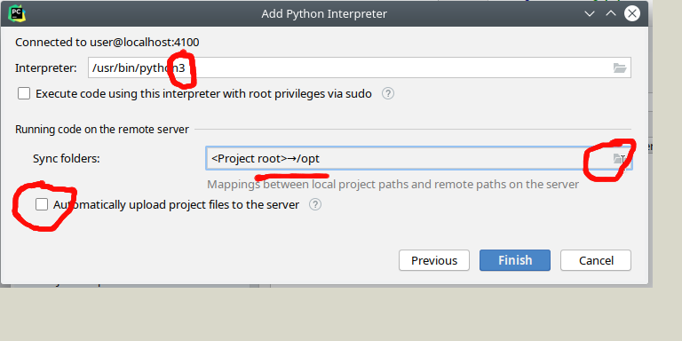

# kickstart-flavor-datalytics :: Data Analytics Container

see (http://github.com/infracamp/kickstart) for more information.

**This is an experimental container - use with care!**

Document Index:

- [Development Guide for this flavor](DEVELOPMENT.md)
- [Dockerhub page](https://hub.docker.com/r/infracamp/kickstart-flavor-datalytics/)
    - [Tags available](https://hub.docker.com/r/infracamp/kickstart-flavor-datalytics/tags/)
    - [Build details](https://hub.docker.com/r/infracamp/kickstart-flavor-datalytics/builds/)

## Installed Software

| Package               | Url                                              |
|-----------------------|--------------------------------------------------|
| **Jupyter**           | [http://localhost:4000](http://localhost:4000)   |
| **SSH remote debug**  | Port 4100 (User: 'user', no password)            |
| **RStudio Server**    | [http://localhost:4200](http://localhost:4200)   |

- *R 3.4.4*
- *Python 3.6.7*

## Creating a new Project

- Create and checkout an empty repository
- Download and execute [`kickstart.sh`](https://infracamp.org/getting-started/) - let it create an empty .kick.yml
- Change `from:`-Line in `.kick.yml` to `infracamp/kickstart-flavor-datalytics`
- Create a `.gitignore` from [this preset](doc/.gitignore)
- Setup a python3 **virtualenv** [see howto on infracamp/kickstart-flavor-py3](https://github.com/infracamp/kickstart-flavor-py3)

## Remote debugging

In development mode a ssh port is opened on Port `4100`. This port should be blocked in your firewall for
incoming traffic from outside networks.

### PyCharm Debugging / Source control

You need **PyCharm Professional** to enable interpreter over ssh.

Go to **File** > **Settings**:

Make sure that *Automatically upload files to server* is turned **off** and *path mapping* of your Project directory
links to **`/opt`** and python interpreter is set to python**3**

